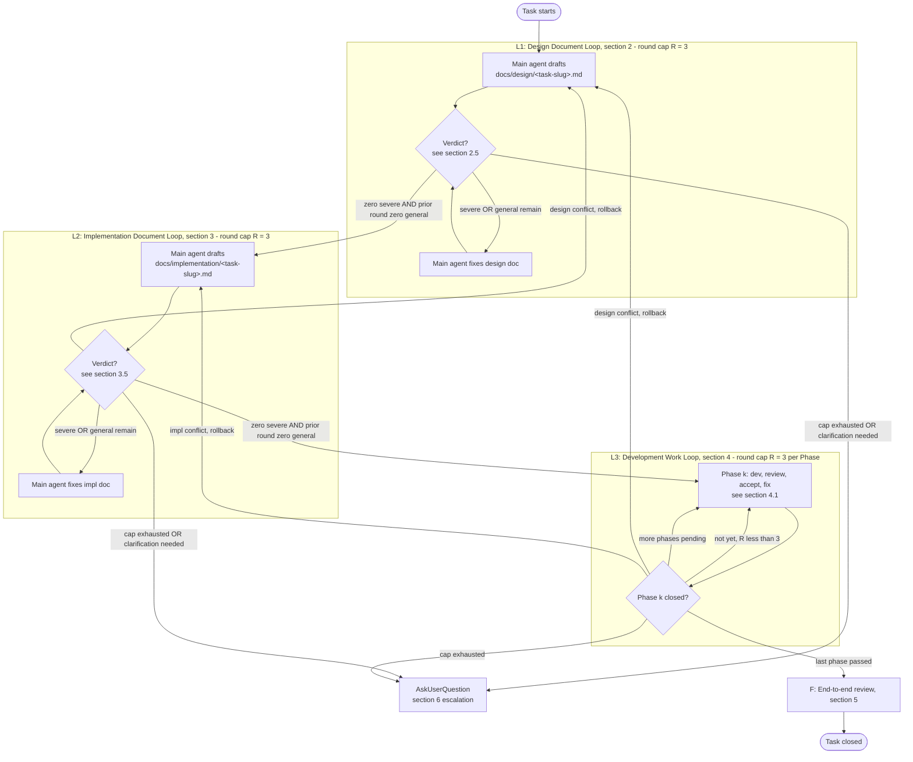
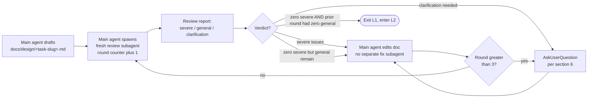
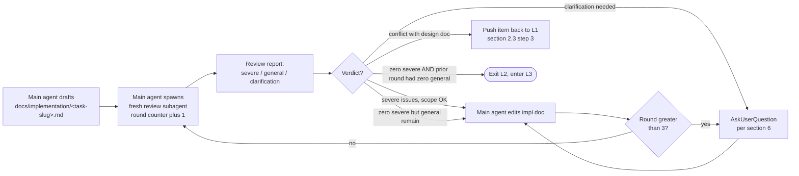
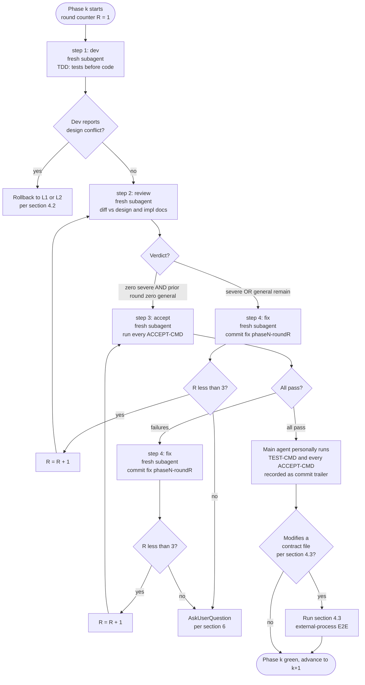

# Three-Loop Development Workflow (Generic Template)

> This document defines the meta-process every development, optimization, or verification task in this repository must follow. It is designed to be reusable across repositories. Each task is composed of three top-down loops: **Design Document Loop, Implementation Document Loop, Development Work Loop**. The four-corner subagent template at Phase level (dev, review, accept, fix) is inlined in section 4.1.
>
> **Placeholder convention**: `<TEST-CMD>` denotes the project test command (typically `pytest tests/ -v` for Python projects, `npm test` for Node, `go test ./…` for Go). `<ACCEPT-CMD>` denotes the acceptance commands declared per Phase in the implementation document. Concrete values are declared by each project in `CLAUDE.md`.

## 0. Coding Philosophy (Foundation for L1 / L2 / L3)

The three-loop workflow operationalizes four non-negotiable principles. Every subagent (main, review per sections 2.4 / 3.4 / 4.1 step 2, dev per 4.1 step 1, accept per 4.1 step 3, fix per 4.1 step 4) inherits these. When a principle conflicts with apparent progress, the principle wins. Violation of any principle is a regression of the workflow itself, regardless of whether tests pass.

### 0.1 Think Before Coding

**Surface, do not assume. Confusion is signal, not noise.**

- State assumptions explicitly. If uncertain, stop and ask via the section 6 escalation rules. Never substitute "reasonable defaults" for a real decision.
- When multiple interpretations exist, present them with trade-offs. Picking silently is forbidden.
- When a simpler path exists, name it and push back. Senior judgment is mandatory, not optional.

**Enforcement points**: section 2.2 item 4 requires every design decision to enumerate candidate options, rejected alternatives, and reasoning. The L1 review subagent (section 2.4) treats single-option decisions and missing trade-offs as severe issues. Section 6 lists the canonical escalation triggers; the AskUserQuestion tool call must include candidates, recommendation, and rationale.

### 0.2 Simplicity First

**Minimum code that solves the stated problem. Nothing speculative.**

- No features beyond the design document's Deliverables (section 2.2 item 2).
- No abstractions for single-use code.
- No configurability or flexibility that was not requested.
- No error handling for scenarios that cannot occur.
- Self-test before review: "Would a senior engineer call this overcomplicated?" If yes, rewrite before invoking the review subagent.

**Enforcement points**: section 2.2 item 3 (Scope Boundary: explicitly what we do not do) is the L1-level guardrail. Section 4.1 step 1 and step 4 forbid dev and fix subagents from expanding scope or introducing requirements outside the design document. The L2 review subagent (section 3.4) flags any Phase task that exceeds design scope as a severe issue.

### 0.3 Surgical Changes

**Touch only what the request requires. Clean up only your own mess.**

- Do not "improve" adjacent code, comments, or formatting.
- Do not refactor what is not broken.
- Match existing style even when you would write it differently.
- Notice unrelated dead code: mention it, do not delete it.
- When your changes orphan an import, variable, or function, remove it. Do not remove pre-existing dead code unless asked.

**The trace test**: every changed line must trace directly to either (a) a Deliverable in the design document, or (b) a section 6 escalated decision recorded in the design document. Lines that pass neither test must be reverted before the L3 review subagent runs.

**Enforcement points**: section 4.1 step 4 explicitly bans structural refactors inside fix rounds. Section 4.2 commit discipline (`fix(phaseN-roundR): <failing-item-keyword>`) requires every fix commit to name the acceptance item it closes. Drive-by edits leave no valid keyword and thus cannot be committed under the convention.

### 0.4 Goal-Driven Execution

**Define success criteria. Loop until mechanically verified.**

- Success is defined as: design document Acceptance Criteria (section 2.2 item 7) AND all `<ACCEPT-CMD>` exit code 0 AND `<TEST-CMD>` exit code 0.
- "I think it works" does not close a Phase. The accept subagent (section 4.1 step 3) does, by reporting pass on every command.
- Every loop has an explicit termination condition (sections 2.5, 3.5, 4.4). No loop exits on intuition.
- Round caps (3 per domain, independently counted) exist to force escalation, not to ship half-done work. Hitting the cap means invoking section 6, not silently lowering the bar.

**Enforcement points**: the closed-loop structure of L1, L2, L3 (fresh review subagent each round, zero severe issues required to exit, deadlock surfaced to the user) embodies this principle. Section 5 closes the outermost loop against the design document Deliverables before task close-out.

### 0.5 Composition Across Loops

|Loop / Stage|Primary principle in force|Failure mode it prevents|
|---|---|---|
|L1 design (section 2)|Think Before Coding|Silent decisions, missing alternatives, vague deliverables|
|L1 design (section 2.2 item 3)|Simplicity First|Scope creep baked into requirements|
|L2 impl (section 3)|Simplicity First|Phase plans that exceed design scope|
|L2 impl (section 3.2)|Goal-Driven Execution|Acceptance criteria that are not mechanically verifiable|
|L3 dev (section 4.1 step 1)|Surgical Changes|Drive-by refactors, formatting churn, opportunistic deletions|
|L3 fix (section 4.1 step 4)|Surgical Changes|Structural rewrites disguised as fixes|
|L3 accept (section 4.1 step 3)|Goal-Driven Execution|Phase closure on author confidence rather than green commands|
|Section 6 escalation|Think Before Coding|"Reasonable default" used to dodge a real decision|

### 0.6 Scope of Application

- Any **functional change** to this repository: new feature, bug fix, optimization, externally observable behavior change.
- Any modification to a **load-bearing process document** counts as a behavioral change and must complete the full L1, L2, L3 cycle plus an independent agent review. The minimum set includes:
	- This file
	- `CLAUDE.md`
	- Any other contract files explicitly declared by the project under its CLAUDE.md _load-bearing-docs_ role (typically `SKILL.md`, OpenAPI specs, schema definitions, public API contracts)

	Drift between the commitments in these files will desynchronize every later task.

- **Transitional clause**: when a document is first introduced or first retroactively classified as load-bearing (including the first version of this file), a one-page retroactive design brief plus an independent agent review with two consecutive clean rounds may substitute for the full three-loop cycle. Any subsequent modification must follow the formal L1, L2, L3 procedure.
- Pure document reordering, typo fixes, and dependency upgrades are **non-behavioral changes** and do not require the three-loop cycle, but still require one independent agent review.
- In every loop, the same agent must not both author and review. Review must be performed by a fresh agent that receives only the relevant context and the agent skill specification.

### 0.7 CLAUDE.md Role Vocabulary

This workflow references the project's CLAUDE.md by **role**, not by literal heading name, so it remains portable across projects whose CLAUDE.md heading conventions differ. A role is a logical responsibility that some section of CLAUDE.md must fulfill. Each project pins concrete heading text to each role at the top of its CLAUDE.md (a short anchor map suffices).

The five roles required by this workflow:

|Role|Responsibility|
|---|---|
|_repo-workflow_|How tasks proceed in this repo: entry points, who triggers L1 / L2 / L3, escalation contacts, link to this WORKFLOW.md|
|_load-bearing-docs_|Concrete list of contract files protected by the full L1 / L2 / L3 cycle per section 0.6 (typically SKILL.md, OpenAPI specs, schema definitions, public API contracts)|
|_language-policy_|Language and terminology rules: which language is used in code, in process docs, in contract files; terminology-consistency requirements|
|_common-commands_|Concrete value of `<TEST-CMD>` and other shell commands the workflow invokes|
|_engineering-norms_|Project-level coding standards, architecture overview, anti-patterns, "what not to do" rules cited by the impl doc Engineering Constraints Index|

Throughout this document, references such as "CLAUDE.md _language-policy_ role" mean "the section of CLAUDE.md that fulfills the language-policy role, whatever that section is named in this project's CLAUDE.md". A project may add more roles, but removing or renaming any of these five breaks the workflow's portability guarantee.

To make grep-based self-checks reliable (see section 7.1), each project should pin a short anchor map at the top of its CLAUDE.md mapping role names to actual heading text used in that project.

## 1. Overview

The three loops are labeled **L1 / L2 / L3**. The closing step is **F**.



Each loop must satisfy its termination condition (zero severe issues this round AND zero general issues in the prior round, per section 2.5) before advancing. Hitting the round cap or detecting a downstream document conflict routes back upstream rather than relaxing the bar.

**Document creation convention**: `docs/design/` and `docs/implementation/` are not pre-existing knowledge bases. They are created on demand per task during L1 / L2. The first task simply runs `mkdir -p docs/design docs/implementation` at the repository root and writes its files. No pre-planned directory structure or README index is maintained for these directories.

## 2. Loop 1: Design Document Loop

### 2.1 Goal

Produce a **self-contained** `docs/design/<task-slug>.md` such that any fresh agent can complete subsequent work using only that file plus the upstream design documents it explicitly references. No context from the current session is required.

### 2.2 Required Sections

1. **Background and Purpose**: why we are doing this, what happens if we do not.
2. **Deliverables**: a checkbox list of finished artifacts.
3. **Scope Boundary**: explicitly state what is NOT in scope, to prevent scope creep.
4. **Key Design Decisions**: each decision lists "problem, candidate options, choice and rationale", including the reasons rejected alternatives were rejected.
5. **Dependencies and Assumptions**: prerequisites, external systems, data formats.
6. **Relationship with Existing Designs**: cite chapter and line numbers in existing `docs/design/*.md` files. If this is the first design document, note "no prior design; terminology anchors are CLAUDE.md section Language / Terminology and the project README". Mark conflicts with a warning marker; when the source of truth cannot be determined, ask the user per section 6.
7. **Acceptance Criteria**: each criterion must be **measurable and automatable**. Statements like "code quality is good" are forbidden.
8. **Risks and Rollback**: identified failure modes plus rollback mechanisms.

### 2.3 Main Agent Procedure

1. If existing `docs/design/*.md` files are present, read them all first to build a design map and avoid conflicts or duplicate modeling. The first task may skip this step.
2. Read the CLAUDE.md _language-policy_ and _load-bearing-docs_ roles to confirm project requirements on language, terminology consistency, and contract file scope.
3. On encountering ANY of the following signals, **stop and ask the user**. Do not silently assume.
	
	- Vague deliverables (for example "improve performance", "make it more readable").
	- Multiple candidate options whose trade-offs have no clear winner.
	- Possible conflict with an existing design where it is unclear whether to follow the design or the patch.
	- **Breaking changes**: schema, exit codes, CLI arguments, storage layout, external protocol, directory structure.

	Use the AskUserQuestion tool. Every question must include candidate options, a recommendation, and the rationale for the recommendation. Pure open-ended questions are forbidden.

4. After the first draft, proceed to section 2.4.

The L1 loop dynamic (review-fix iteration up to the section 2.5 round cap):



### 2.4 Design Document Review Subagent Prompt Template

```plaintext
You are the design review engineer for the {{project-name}} project.

[Task] Review the draft at {{design-doc-path}} and surface issues and
improvements.

[Language constraint]
If the artifact under review falls within the project core contract scope
listed under the CLAUDE.md *language-policy* role (such as SKILL.md,
source directories, references, public API contracts), any violation of
the language policy (such as mixing in non-designated languages,
terminology drift) is logged as a severe issue. The language of the
design document itself is governed by CLAUDE.md, but its terminology
must be consistent with existing docs/design/, project README, and core
contract files.

[Steps]
1. Read {{design-doc-path}} in full.
2. Read every docs/design/*.md section it cites under "Relationship with
   Existing Designs". If this is the first design document, read instead
   the contract files referenced by CLAUDE.md as terminology anchors.
3. Read CLAUDE.md and this WORKFLOW.md.
4. Audit each of the eight sections in 2.2 against these checks:
   - Are there acceptance criteria that cannot be automated?
   - Are deliverables in checkbox form?
   - Are there conflicts with existing designs that lack a warning marker?
   - Are there decisions that present only one option, with no trade-off
     comparison?
   - Is the scope boundary tight enough, with no smuggled-in extensions?
   - Do risks and rollback cover the most likely failure paths?
   - Coding philosophy (sections 0.1 to 0.4): any violation (silent
     defaults, speculative scope, missing trade-offs) is a severe issue.
5. Do not modify the document. Output only the review report.

[Output format]
## Design Document Review Report (round {{round}})

### Severe issues (block entry to L2)
- [section] description and suggested fix direction

### General issues (recommend fixing this round)
- …

### Clarification items (require main agent to consult user)
- …

### Verdict
pass / needs fix / severe non-conformance
```

### 2.5 Termination Conditions (shared by L1, L2, L3)

- **Pass**: the review subagent reports zero severe issues this round, and one consecutive round reports zero general issues. Exit the current loop.
- **Hard cap, per domain**: L1 and L2 are counted independently with a cap of 3 rounds each. L3 is counted independently per Phase, also capped at 3. **No cross-domain accumulation**: even if L1 takes all 3 rounds to pass, L2 still starts at round 1. If any single domain fails to clear severe issues by round 3, suspend the loop and escalate via AskUserQuestion to the user with a deadlock report.
- **Round counter substitution**: the main agent increments `{{round}}` before spawning each review subagent. The subagent must never receive the literal `{{round}}` string.
- Fixes are made directly by the main agent. No separate subagent is spawned for fixes (the scale is small).
- If a new user-decision point is identified mid-loop, return to step 3 of section 2.3 to ask the user. Do not decide unilaterally.

## 3. Loop 2: Implementation Document Loop

### 3.1 Goal

Produce `docs/implementation/<task-slug>.md` (or append a new Phase file) such that a fresh agent can read it and immediately enter TDD development **without** reviewing the current session.

### 3.2 Required Sections

1. **Task Index**: pointers to the corresponding Deliverables and Acceptance Criteria entries in the design document.
2. **Phase Breakdown**: each Phase is self-contained and lists:
	- Entry condition (what the previous Phase must deliver)
	- Design document references (file plus line range)
	- Task list (TDD-ordered: tests before code)
	- Per-task **acceptance command** (a pytest selector or shell command that runs directly from the repository root)
	- Exit condition (the state that defines Phase completion)
3. **Engineering Constraints Index**:
	- Project-level engineering norms: CLAUDE.md _engineering-norms_ role
	- Four-corner subagent template: this file, section 4.1
	- Commit conventions: this file, section 4.2 (the `fix(phaseN-roundR):` prefix, etc.)
4. **Data and Fixture Dependencies**: which existing test resources can be reused and whether new ones must be added.
5. **Regression Protection**: which prior-Phase tests must remain green.

### 3.3 Main Agent Procedure

1. Draft based on the passed design document. Forbidden to introduce new requirements not in the design document.
2. Phase granularity principles:
	- About 2 to 4 days of work per Phase, independently committable, and verifiable in CI.
	- `<TEST-CMD>` is fully green at the end of every Phase.
	- Every Phase declares at least one shell-reproducible `<ACCEPT-CMD>` (pytest selector, script invocation, or other deterministic command).
3. On encountering ambiguity (for example an acceptance criterion that cannot be translated to an executable test), immediately return to section 2.3 step 3, or push the item back to the design document for revision before re-entering this loop.

The L2 loop dynamic (independent round counter; if the design document is forced to roll back, this loop restarts from round 1 per section 3.5):



### 3.4 Implementation Document Review Subagent Prompt Template

```plaintext
You are the implementation review engineer for the {{project-name}}
project.

[Task] Review {{impl-doc-path}} and confirm it can guide a fresh agent
to start work without ambiguity.

[Language constraint] Same as 2.4: violations of the CLAUDE.md
*language-policy* role in core contract files are severe issues. The
implementation document itself follows CLAUDE.md rules for process
documents, but its terminology must align with docs/design/ and contract
files.

[Steps]
1. Read {{impl-doc-path}} in full and {{design-doc-path}}.
2. For each Phase, answer four questions. Any "no" is a severe issue.
   a. Could a fresh agent start work using only this document plus the
      design document sections it cites?
   b. Are the acceptance commands actually runnable? (pytest selectors
      must reference tests defined in tests/ or required by the document
      to be created; shell commands must be runnable in the current
      repository.)
   c. Is the TDD order correct (test tasks before implementation tasks)?
   d. Does regression protection cover the critical paths of prior
      Phases?
3. Check consistency with CLAUDE.md and WORKFLOW.md (commit prefix
   `fix(phaseN-roundR):`, language policy, load-bearing document list).
4. Coding philosophy check (sections 0.1 to 0.4): flag any Phase task
   that exceeds the design scope as a severe issue (Simplicity First).
   Flag any acceptance criterion that is not mechanically verifiable as
   severe (Goal-Driven Execution).
5. Do not modify the document. Output only the review report.

[Output format] Same as 2.4, with the section title changed to
"Implementation Document Review Report".
```

### 3.5 Termination Conditions

Same as 2.5. Reiterate: the L2 round cap of 3 is counted independently. If the design document is forced into rollback edits, the implementation document loop **must restart**. Commits already produced under the prior L3 cycle are listed by the main agent under a "Deprecated" section in `docs/implementation/<task-slug>.md` to prevent implementation drift.

## 4. Loop 3: Development Work Loop

### 4.1 Four-Corner Subagent Template

Each Phase runs at least one cycle of step 1 (dev) to step 2 (review) to step 3 (accept). Review failures route through step 4 (fix) back to step 2; accept failures route through step 4 back to step 3. The Phase shares the per-Phase round counter R with the section 2.5 cap of 3.



Notes on the diagram:

- "Fresh subagent" appears on every role node to enforce the section 4.1 role isolation rule.
- The round counter R increments only on a fix; the cap is checked before re-entry. Hitting R = 3 with the failure unresolved escalates to AskUserQuestion, never to a relaxed bar.
- Accept failures loop back to step 3, not step 2: the accept subagent re-runs commands without re-spawning the review subagent. This matches the document text "Any failure reported by step 3 must go through step 4 (fix) and back to step 3".
- Phase-end main-agent verification (section 4.2) sits between the accept pass and the section 4.3 E2E gate, so its result is captured in the Phase commit trailer regardless of whether E2E is triggered.
- The section 4.3 gate is conditional: pure internal refactors, test changes, and README updates skip the E2E branch.

|Role|Input|Output|Forbidden|
|---|---|---|---|
|**step 1: dev**|Phase task list in impl doc plus design doc references|Code changes (TDD: tests first), task list checkboxes ticked|Modify the impl doc; expand scope unilaterally|
|**step 2: review**|dev's diff plus design doc, impl doc, CLAUDE.md|Review report (severe / general / clarification, format per 2.4)|Modify code|
|**step 3: accept**|Phase `<ACCEPT-CMD>` list from impl doc|Per-command exit code and key output, marked pass or fail|Modify code or tests|
|**step 4: fix**|Failing items from step 2 or step 3|Minimal-scope code fix; commit prefix `fix(phaseN-roundR):`|Structural refactors; introduce new requirements outside the design doc|

**Role isolation hard constraint**: within a single Phase, a single subagent may take only one role. The main agent spawns a fresh subagent per role per round. Self-review is forbidden.

### 4.2 Additional Main Agent Constraints

- At the end of **each Phase**, the main agent personally runs `<TEST-CMD>` and every `<ACCEPT-CMD>` declared for that Phase in the impl doc. The results are recorded as trailers on the Phase commit.
- If a dev subagent reports "the design doc conflicts with the task", the dev agent **must not** decide. Return to loop 1 or loop 2 to fix the source document.
- **Commit conventions**:
	- Phase opener: `feat(phaseN): <one-line summary>` or `fix(phaseN): …` depending on change nature.
	- Within-round fix: `fix(phaseN-roundR): <failing-item-keyword>`.
	- Trailers record the `<TEST-CMD>` exit code and key `<ACCEPT-CMD>` results.
	- **Do not** mention AI involvement, model names, or agent tooling in commit messages or PR descriptions.

### 4.3 External-Process / End-to-End Verification (Triggered as Needed)

**Trigger condition**: only when the task modifies an **external behavior contract**, that is, the contract files declared by the CLAUDE.md _load-bearing-docs_ role (such as SKILL.md, public API spec) or entry scripts / endpoints directly referenced by them. Pure internal refactors, test changes, and README updates rely on `<TEST-CMD>` only and **do not** re-run external processes.

> The example below uses the scenario "load and run a skill via a real CLI subprocess" (suitable for agent / skill / CLI tool projects). Web service projects can replace the example with "start the service in an isolated container plus run end-to-end test scripts". The general principles preserved are: **isolated worktree, ephemeral sandbox, artifact archival, automatic cleanup**.

#### 4.3.1 Pre-flight Check (Zero Cost, No Paid API Calls)

```bash
# Example uses Claude Code; replace with the equivalent auth-probe command
# for other CLIs.
[ "$(id -u)" = "0" ] && { echo AUTH_FAIL; exit 0; }   # root often refused

if claude auth status >/dev/null 2>&1; then
  echo AUTH_OK
elif claude --version >/dev/null 2>&1 && [ -n "${ANTHROPIC_API_KEY:-}" ]; then
  echo AUTH_OK
else
  echo AUTH_FAIL
fi
```

On failure, enter the degraded path: skip the external-process spawn, fall back to `<TEST-CMD>` plus one manual smoke test (walk the entry-point flow described in the contract file by hand), and record "section 4.3 skipped: <reason>" in the section 5 final delivery summary.

#### 4.3.2 Isolated Spawn Procedure (Example)

```bash
set -euo pipefail                                # abort on any failure
TASK_SLUG="<kebab-case-task-id>"
STAMP="$(date -u +%Y%m%dT%H%M%SZ)"
SID="$(python3 -c 'import uuid; print(uuid.uuid4())')"
WT="$(mktemp -d -t e2e-wt-XXXXXX)"               # isolated worktree
SANDBOX="$(mktemp -d -t e2e-sandbox-XXXXXX)"     # one-shot sandbox
ARTIFACTS="./.e2e-artifacts/${TASK_SLUG}-${STAMP}"        # gitignore this
mkdir -p "${ARTIFACTS}"
git worktree add "${WT}" HEAD -b "e2e/${TASK_SLUG}-${STAMP}"

# Example: spawn the Claude CLI as a subprocess to load and run the skill.
# Other projects replace with curl / docker compose run / go run / etc.
(
  cd "${WT}"
  claude \
    --print \
    --dangerously-skip-permissions \
    --session-id "${SID}" \
    --output-format stream-json \
    --max-budget-usd 0.50 \
    -p "<end-to-end test prompt designed against the contract file, parameterized by SANDBOX>"
) > "${ARTIFACTS}/stream.jsonl" 2> "${ARTIFACTS}/stderr.log"

# Cleanup
git worktree remove --force "${WT}"
git branch -D "e2e/${TASK_SLUG}-${STAMP}" 2>/dev/null || true
rm -rf "${SANDBOX}"
# ${ARTIFACTS} is retained for archival. To promote into a test fixture,
# raise a separate PR (see 4.3.3).
```

#### 4.3.3 Archival and Naming

- Active artifacts: `./.e2e-artifacts/<task-slug>-<UTC-ISO8601>/` (on first use, add `.e2e-artifacts/` to `.gitignore`).
- Promoted to test fixture: only after manual review, rename to `./tests/fixtures/e2e/<descriptive-slug>.<ext>` (create the directory if needed) and submit in a **separate** PR with an update note in `docs/implementation/`. **Do not** add fixtures opportunistically inside the feature PR.

### 4.4 Termination Conditions

- The accept subagent reports pass on every command for the Phase.
- Full `<TEST-CMD>` and every `<ACCEPT-CMD>` declared in the impl doc exit with code 0.
- If section 4.3 is triggered, the external-process artifacts contain no errors beyond what the contract file allows. The impl doc must declare pass conditions explicitly (such as "lint JSON returns clean: true" or "HTTP 200 plus JSON schema validation passes").

## 5. End-to-End Review

Before closing the task, the main agent must:

1. Tick every entry under the design document Deliverables. Unfinished items require an explicit reason and a follow-up issue.
2. Run `<TEST-CMD>` plus every `<ACCEPT-CMD>` declared in the impl doc and paste the result summary.
3. If section 4.3 was triggered, attach key output snippets from the external-process smoke test. If skipped due to auth or environment, record "section 4.3 skipped: <reason>" plus the `<TEST-CMD>` summary as substitute evidence.
4. Confirm no leftover temporary worktrees or branches remain (`git worktree list` and `git branch --list 'e2e/*'` spot-check).
5. Write the final commit per the section 4.2 conventions (do not mention AI involvement).

## 6. Uncertainty Escalation Rules (All Three Loops)

At any moment, on encountering the following situations, **immediately suspend the current loop and ask the user**:

|Situation|Action|
|---|---|
|Deliverables admit multiple interpretations|AskUserQuestion: list candidates plus recommendation|
|Internal contradiction in the design document with no patch in sight|AskUserQuestion: request a source-of-truth ruling|
|Breaking change (schema, exit code, CLI arg, storage layout, external protocol)|AskUserQuestion: also state the migration cost|
|Credentials, network, or permissions unavailable|First use Bash to verify the failure reason, then report to the user|
|Magic number or default threshold (algorithm parameter, weight, timeout, batch size)|Cite an existing constant from `docs/design/` or the source. If none exists, AskUserQuestion|
|Schema backward-compatibility ruling (keep, migrate, or drop legacy fields)|AskUserQuestion: include migration impact surface|
|Action exceeds authorized scope (push to main, delete files outside the workspace, send messages externally)|Request authorization first|

**Forbidden**: bypass the question with a "reasonable default". Delaying delivery is preferable to leaving design debt.

If the AskUserQuestion tool is unavailable in the current harness, degrade to a plain-text question segment in the main output beginning with `STOP: QUESTION` and suspend all subagent spawns until a reply arrives.

## 7. Relationship with CLAUDE.md

- **`CLAUDE.md`**: project index. Provides project-specific configuration fulfilling each of the five roles defined in section 0.7 (_repo-workflow_, _load-bearing-docs_, _language-policy_, _common-commands_, _engineering-norms_), plus any project-specific extensions.
- **This file (`WORKFLOW.md`)**: cross-project meta-process: three loops, design / impl review templates, four-corner subagent template, commit conventions, external-process verification constraints.
- **Per-task outputs**: `docs/design/<task-slug>.md` and `docs/implementation/<task-slug>.md` are created on demand during L1 and L2. They are not maintained as a pre-existing library, and no README index is kept for these directories.

`CLAUDE.md` and `WORKFLOW.md` reference each other in read-only fashion to prevent content drift: process clauses live in `WORKFLOW.md`, project-specific configuration lives in `CLAUDE.md`.

### 7.1 Cross-File Consistency Checklist (Template)

When modifying any **commitment clause** below, the same commit must update both the "source of truth" and the "reference site". Self-check before submitting. Each project extends this table with project-specific clauses in its own CLAUDE.md.

**Note on CLAUDE.md anchors**: items written in _italics_ below are **roles** as defined in section 0.7, not literal heading names. Each project resolves these roles to whatever heading text its CLAUDE.md uses. References that begin with `WORKFLOW.md` are literal — this file's structure is fixed across projects.

|Clause category|Source of truth|Required reference site|
|---|---|---|
|Coding philosophy (sections 0.1 to 0.4)|`WORKFLOW.md` section 0|`WORKFLOW.md` sections 2.4 / 3.4 / 4.1 review templates (any violation is a severe issue)|
|Three-loop trigger conditions (L1, L2, L3)|`WORKFLOW.md` sections 0.6 / 1|CLAUDE.md _repo-workflow_ role (the section that tells contributors how this repo's tasks proceed)|
|CLAUDE.md role vocabulary|`WORKFLOW.md` section 0.7|CLAUDE.md anchor map at the top of the file (role-to-heading bindings)|
|Four-corner subagent template|`WORKFLOW.md` section 4.1|`WORKFLOW.md` section 3.2 Engineering Constraints Index|
|Commit prefix `fix(phaseN-roundR)`|`WORKFLOW.md` section 4.2|`WORKFLOW.md` section 3.4 review template|
|External-process E2E trigger|`WORKFLOW.md` section 4.3|CLAUDE.md _repo-workflow_ role (one-line forward reference)|
|Load-bearing document list|`WORKFLOW.md` section 0.6 plus CLAUDE.md _load-bearing-docs_ role|All listed contract files cross-reference each other in their headers|
|Language and terminology policy|CLAUDE.md _language-policy_ role|`WORKFLOW.md` sections 2.4 / 3.4 review templates|
|Test command `<TEST-CMD>`|CLAUDE.md _common-commands_ role|The "acceptance command" section of every impl doc|
|Project engineering norms|CLAUDE.md _engineering-norms_ role|`WORKFLOW.md` section 3.2 Engineering Constraints Index|

When introducing a new commitment clause, register its source of truth and reference site in this table BEFORE modifying any file. If the new clause needs a CLAUDE.md anchor that is not yet in the section 0.7 five-role minimum, either reuse an existing role or extend the role vocabulary in section 0.7 in the same commit.

Self-check command examples (substitute each `<role-anchor>` with the literal heading text or anchor that the project's CLAUDE.md uses for that role; the anchor map at the top of CLAUDE.md provides the substitution):

```bash
# Confirm load-bearing docs are declared in CLAUDE.md and referenced in WORKFLOW.md.
grep -n "<load-bearing-docs anchor>" CLAUDE.md
grep -n "load-bearing" WORKFLOW.md

# Confirm the commit prefix convention is intact.
grep -n "fix(phaseN-roundR)" WORKFLOW.md

# Confirm the role vocabulary is defined and the anchor map is present.
grep -n "Role Vocabulary" WORKFLOW.md
grep -n "anchor map\|role.*heading" CLAUDE.md
```

