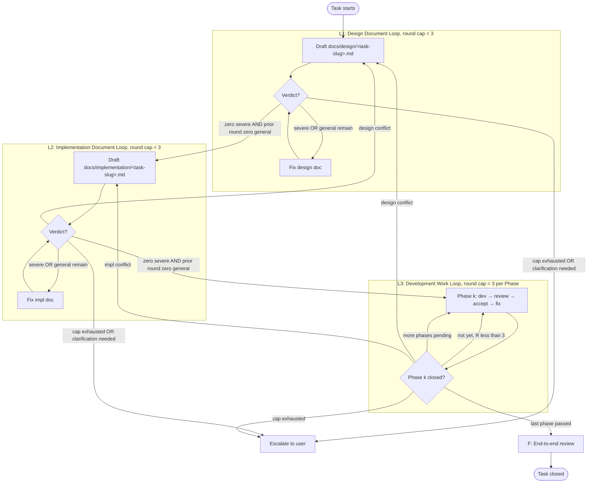

# Three-Loop Development Workflow

Every non-trivial functional change passes through three top-down loops — **L1 Design Document Loop**, **L2 Implementation Document Loop**, **L3 Development Work Loop** — followed by a final **F: End-to-End Review**.

The workflow exists because shipping code without explicit design surfacing, mechanical acceptance, and fresh-eyes review consistently produces drift, scope creep, and hard-to-debug regressions. Following this loop is slower per-task but eliminates a category of failures that compound across tasks.

Throughout this skill, `<TEST-CMD>` denotes the project test command (typically `pytest tests/ -v` for Python, `npm test` for Node, `go test ./...` for Go) and `<ACCEPT-CMD>` denotes the per-Phase acceptance commands declared in the implementation document. Concrete values come from the project's `CLAUDE.md` _common-commands_ role (see "Project integration" below).

## Which tier applies

This skill runs in two tiers. **Full Mode** is the complete L1 → L2 → L3 → F cycle. **Light Mode** (small, low-risk changes) keeps the fresh-reviewer review, round caps, and the four principles, but replaces the 8-section design doc with a four-field brief and drops the separate L2 doc + the F consolidation. Procedure: `references/light-mode.md`.

| Tier | When | What runs |
|---|---|---|
| **Full Mode** | Any load-bearing file (CLAUDE.md, this skill, SKILL.md, OpenAPI specs, schema definitions, public API contracts); any breaking change; any migration (schema / data / config / storage / API-version / dependency); any unresolved >1-option design decision; any magic-number / threshold decision; or a change touching more than 3 non-load-bearing files. **When in doubt → Full.** Deleting a load-bearing doc is Full **plus** mandatory AskUserQuestion before any file is deleted (see `references/escalation-rules.md`). | Full L1 → L2 → L3 → F |
| **Light Mode** | ≤ 3 non-load-bearing files, no breaking change, no new external contract, no unresolved decision. Typical small features, bug fixes, and local refactors land here. | `references/light-mode.md`: four-field brief → fresh-reviewer diff review → accept → one-line closure |
| **None** | Pure typo / doc reordering / minor/patch dependency upgrade (one independent fresh-agent review, no cycle); or a question with no file edits (no requirement). A trivial load-bearing edit that changes no rule is None; a substantive one is Full. The None reviewer re-confirms no rule changed and routes to Full on any commitment-clause touch (references/light-mode.md). | one independent review, or nothing |

The Full-Mode gate is a **hard filter**: any "yes" forces Full Mode. Tier choice is fresh-eyes-enforced, not author-asserted — the Light-Mode and None-tier reviewers re-run this gate against the diff (see `references/light-mode.md`).

When a load-bearing doc is **first introduced** (or first retroactively classified as load-bearing), a one-page retroactive design brief plus an independent agent review meeting the standard two-generation termination may substitute for the full three-loop cycle. Any subsequent modification must follow the formal procedure.

**Cost expectation.** A full cycle is deliberately heavier than one pass (≈8–15 fresh subagents, two committed docs) — see `references/loop-3-workflow.md`.

**Role isolation rule** (every loop): a single subagent must never both author and review the same artifact — whether the second role would arrive via lead assignment, teammate self-claim, or lead plan-approval. Lead plan-approval is autonomous coordination, not the fresh-reviewer gate. Reviews use a fresh subagent that receives only the artifact, the prompt template, and the linked design/impl docs. (Agent-team specifics: `references/loop-3-teams.md`.)

```
HITTING THE ROUND CAP ESCALATES — IT NEVER LOWERS THE BAR.
```

> **Operating rule**: execute this skill from the reference files, not from this page. Once routed to a
> reference, read it in full before acting — do not paraphrase the procedure from a summary here. Operating
> from a gist is the drift this skill exists to prevent. You cannot skip a loop. If unsure which loop you are in, check the routing table.

**Round tracking** (optional): keep round-cap state in Tasks so it survives context compaction — see `references/loop-3-workflow.md`.

## Core principles (non-negotiable, every loop, every subagent)

When a principle conflicts with apparent progress, the principle wins. Violation by any subagent is a regression of the workflow itself, regardless of whether tests pass.

### 0.1 Think Before Coding — surface, do not assume

- State assumptions explicitly. If uncertain, stop and escalate (see `references/escalation-rules.md`). Never substitute "reasonable defaults" for a real decision.
- When multiple interpretations exist, present them with trade-offs. Picking silently is forbidden.
- When a simpler path exists, name it and push back. Senior judgment is mandatory, not optional.
- Single-option design decisions and missing trade-offs are severe issues at L1 review.

### 0.2 Simplicity First — minimum code that solves the stated problem

- No features beyond the design document's Deliverables.
- No abstractions for single-use code.
- No configurability or flexibility that was not requested.
- No error handling for scenarios that cannot occur.
- Self-test before review: "Would a senior engineer call this overcomplicated?" If yes, rewrite before invoking the review subagent.

### 0.3 Surgical Changes — touch only what the request requires

- Do not "improve" adjacent code, comments, or formatting.
- Do not refactor what is not broken.
- Match existing style even when you would write it differently.
- Notice unrelated dead code: mention it, do not delete it.
- When your changes orphan an import, variable, or function, remove it. Do not remove pre-existing dead code unless asked.
- When two existing patterns in the codebase conflict, pick the more recent or more tested one and flag the other for cleanup. Producing a hybrid that satisfies neither is forbidden. Cleanup of the rejected pattern is a separate task — do not perform it here.
- If you cannot articulate why surrounding code is structured a way, stop and ask before modifying it. Assuming orthogonality between the code you are touching and the code you are not is the dangerous default.
- **Trace test**: every changed line must trace directly to either (a) a Deliverable in the design document, or (b) an escalated decision recorded in the design document. Lines that pass neither must be reverted before the L3 review subagent runs.
- **Comments explain the code, not the workflow.** A comment must explain what the code does or why — never narrate the process that produced it. Do not leave round/cycle history, review-iteration notes, or design-document/decision references in source comments (e.g. `// Cycle A`, `// added in review round 2`, `// per Decision 2`, `// see docs/design/…`). That provenance lives in the design document and git history; in code it is stale-prone noise. This is the most common over-reading of the trace test above: trace a line to its Deliverable in your reasoning, not in a comment.

### 0.4 Goal-Driven Execution — define success, loop until verified

- Success = design Acceptance Criteria met AND all `<ACCEPT-CMD>` exit code 0 AND `<TEST-CMD>` exit code 0.
- "I think it works" does not close a Phase. The accept subagent does, by reporting pass on every command.
- Every loop has an explicit termination condition. No loop exits on intuition.
- Round caps (3 per domain) exist to force escalation, not to ship half-done work. Hitting the cap means escalating to the user, not silently lowering the bar.

### Principle composition (which loop enforces which principle)

| Loop / Stage | Primary principle | Failure mode it prevents |
|---|---|---|
| L1 design (whole loop) | Think Before Coding | Silent decisions, missing alternatives, vague deliverables |
| L1 design (Scope Boundary section) | Simplicity First | Scope creep baked into requirements |
| L2 impl (Phase scope) | Simplicity First | Phase plans that exceed design scope |
| L2 impl (Acceptance commands) | Goal-Driven Execution | Acceptance criteria that are not mechanically verifiable |
| L3 dev step | Surgical Changes | Drive-by refactors, formatting churn, opportunistic deletions |
| L3 fix step | Surgical Changes | Structural rewrites disguised as fixes |
| L3 accept step | Goal-Driven Execution | Phase closure on author confidence rather than green commands |
| Escalation (references/escalation-rules.md) | Think Before Coding | "Reasonable default" used to dodge a real decision |

> **Rationalizations** (the excuses for dodging these principles, and the rule each breaks): see `references/escalation-rules.md` "Rationalizations — recognize and stop".

## The three loops at a glance



Each loop must satisfy its termination condition before advancing. Hitting the round cap or detecting a downstream document conflict routes back upstream rather than relaxing the bar.

**Document creation convention**: `docs/design/` and `docs/implementation/` are **not** pre-existing knowledge bases. They are created on demand per task. The first task simply runs `mkdir -p docs/design docs/implementation` at the repository root and writes its files. No pre-planned directory structure or README index is maintained.

**Document naming**: all task documents use the slug format `YYYY-MM-DD-<kebab-case-feature>`. The design document (`docs/design/YYYY-MM-DD-<slug>.md`) and implementation document (`docs/implementation/YYYY-MM-DD-<slug>.md`) for the same task must use the **identical slug**. Mismatched slugs across these two docs are a protocol error. This convention applies to tasks created after this task closes; pre-existing documents are not renamed.

**Document closure convention**: at task closeout (F), each task's two documents are consolidated in a single focused pass — ephemeral scaffolding pruned, a closure block added (`Status: closed`, `Closing-commit:`, `Closed-on:`, `Deferred:`), and supersedes / superseded-by links recorded if a genuine succession exists. Consolidation is verified by a fresh review subagent. This keeps `docs/design/` and `docs/implementation/` from growing into a graveyard of stale drafts. Procedure and review template live in `references/end-to-end-review.md`.

**Shared termination condition (all loops)**:
- **Pass**: the review subagent reports zero severe issues this round, AND one consecutive prior round reported zero general issues. Exit the loop.
  - **L3 clean-first-round relaxation** (Workflow mode, `references/l3-phase.js`; Light Mode mirrors it — `references/light-mode.md`): a Phase also closes on a *single* round when its first review is fully clean — zero severe AND zero general — and no fix was applied. The moment any fix lands, the standard two-generation rule re-engages. This removes only the tax on correct-first-time work; a round with any unresolved issue never closes. **L1 and L2 keep the strict two-generation rule** (there the second clean round is fresh-reviewer corroboration, not a post-fix re-check).
- **Hard cap, per domain**: 3 rounds, counted independently. L1 / L2 / L3 do not share rounds — even if L1 takes all 3 rounds to pass, L2 still starts at round 1. L3 is counted independently per Phase. Hitting cap → escalate, never relax the bar.
- **Round counter substitution**: increment `{{round}}` before spawning each review subagent. The subagent never receives the literal `{{round}}` string.
- L1 / L2 fixes are made directly by the main agent — no separate fix subagent (scale is small). L3 uses the four-corner template (dev / review / accept / fix), each role a fresh subagent.

## Project integration: CLAUDE.md role vocabulary

This skill references the project's CLAUDE.md by **role**, not literal heading name, so it stays portable across projects with different heading conventions. Each project pins concrete heading text to each role in an "anchor map" at the top of its CLAUDE.md.

The five required roles: **_repo-workflow_** (how tasks proceed here), **_load-bearing-docs_** (the contract files under the full cycle), **_language-policy_** (language/terminology rules), **_common-commands_** (the concrete `<TEST-CMD>` / `<ACCEPT-CMD>` and other shell commands the workflow invokes — resolve those placeholders here), **_engineering-norms_** (coding standards, anti-patterns).

Full role detail, the cross-file consistency checklist, and grep self-checks live in `references/claude-md-integration.md` — read it when authoring a CLAUDE.md anchor map or auditing for drift.

## Routing — which reference file to load next

Once you've confirmed this skill applies to the current task, jump to the relevant phase reference:

| You are about to... | Read this reference |
|---|---|
| Run a small, low-risk change in Light Mode | `references/light-mode.md` — the four-field brief, the Full-Mode gate, the fresh-eyes tier check |
| Understand existing code before L1 (the pre-step) | `references/loop-1-design.md` — "L1 pre-step: Understand before designing" (read-only Explore sweep, not a loop) |
| Draft `docs/design/<task-slug>.md` (L1) | `references/loop-1-design.md` — required sections, main agent procedure, review subagent prompt template |
| Draft `docs/implementation/<task-slug>.md` (L2) | `references/loop-2-implementation.md` — Phase breakdown, review subagent prompt template |
| Start a Phase (L3) — Workflow mode (recommended) | `references/loop-3-workflow.md` — how to invoke `l3-phase.js`, args, return values |
| Start a Phase (L3) — manual/fallback mode: dev → review → accept → fix | `references/loop-3-development.md` — four-corner subagent template, role table, commit conventions |
| Encounter an implementation-document conflict during L3 dev | `references/loop-2-implementation.md` — restart L2 from round 1; list deprecated L3 commits in a Deprecated section |
| Run external-process / E2E verification | `references/loop-3-development.md` (E2E section: pre-flight, isolated spawn, archival) |
| Close out the task: end-to-end review, document consolidation (F) | `references/end-to-end-review.md` |
| Encounter ambiguity, breaking change, or unverifiable acceptance | `references/escalation-rules.md` |
| Escalate a review to an adversarial panel (load-bearing / high-risk artifact) | `references/multi-voter-review.md` — N fresh voters, mechanical union; `reviewMode: 'panel'` in `l3-phase.js` |
| Install optional tool-restricted reviewer agents (built-in `.claude/agents`, model routing) | `references/optional-subagents.md` — definitions, the honest enforcement boundary, mandatory fallback |
| Use agent-team modes (behavior-bug debate, cross-layer L3, parallel F review) | `references/loop-3-teams.md` — three modes, the identity guardrail, "when NOT to use a team" |
| Audit CLAUDE.md / cross-file consistency | `references/claude-md-integration.md` |

## Commit conventions (cross-cutting)

Every code-modifying L3 commit: `feat(phaseN):` / `fix(phaseN):` for a Phase opener; `fix(phaseN-roundR): <failing-item-keyword>` for a within-round fix (the keyword names a failing review/accept item); `<TEST-CMD>` / `<ACCEPT-CMD>` results as trailers; and **no mention of AI involvement, model names, or tooling**. Full conventions, worked examples, the optional commit-prefix lint, and the four-corner role table live in `references/loop-3-development.md` (canonical).

## Self-check before claiming a loop is closed

- L1 closed? `docs/design/<task-slug>.md` exists with all 8 required sections; L2 closed? `docs/implementation/<task-slug>.md` exists with a runnable `<ACCEPT-CMD>` per Phase. Both: review reports zero severe + one prior round zero general.
- Phase closed? Accept subagent reports pass on every command, main agent personally re-ran `<TEST-CMD>` and every `<ACCEPT-CMD>`, results recorded as commit trailers. If a contract file was modified **or the change is externally observable** (UI / CLI / endpoint / user-visible output), the E2E / behavior gate executed or a skip-reason recorded.
- Task closed? End-to-end review (F) completed per `references/end-to-end-review.md` — the project-wide closeout gates ran: repo-wide validation gates green, change-orphan cleanup sweep, whole-project blast-radius review, conditional migration verification, scoped project-doc reconciliation; plus document consolidation (closure block, ephemera pruned, fresh-subagent verdict pass) and `e2e/*` worktrees / unreferenced `.e2e-artifacts/` cleaned up.

If any of these is "no", you have not closed that stage — return to the relevant reference and continue, or escalate.

If AskUserQuestion is unavailable in the current harness, see `references/escalation-rules.md`
Degraded mode for the STOP:QUESTION fallback procedure, including the in-flight-agent
suspension rule.

## Common failure modes and recovery

| Symptom | Likely cause | Recovery |
|---|---|---|
| Review keeps finding severe issues; round counter reaches 3 | Round cap exhausted | Escalate via AskUserQuestion with a deadlock report (see `references/escalation-rules.md`) |
| Agent declares loop closed but prior round had general issues | Incorrect termination check | Two-generation rule violated — re-run the review round; zero-general in the PRIOR round is required |
| L3 dev reports the implementation doc conflicts with the code | Impl-doc conflict | L2 rollback — see routing table row for "Encounter an implementation-document conflict" |
| AskUserQuestion tool unavailable | Constrained harness | Use STOP:QUESTION degraded mode (see `references/escalation-rules.md`) |
| Design and implementation doc slugs don't match | Missed slug convention | Rename to match YYYY-MM-DD-<slug> format (see "Document naming" in Document creation convention) |
