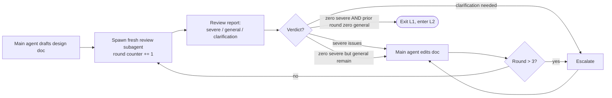

# L1: Design Document Loop

## Goal

Produce a **self-contained** `docs/design/<task-slug>.md` such that any fresh agent can complete subsequent work using only that file plus the upstream design documents it explicitly references. No context from the current session is required.

If `docs/design/` does not yet exist, the first task simply runs `mkdir -p docs/design docs/implementation` at the repository root. No pre-planned directory structure or README index is maintained.

## Required sections (all 8 must be present)

1. **Background and Purpose**: why we are doing this, what happens if we do not.
2. **Deliverables**: a checkbox list of finished artifacts.
3. **Scope Boundary**: explicitly state what is **NOT** in scope, to prevent scope creep at L2 and L3.
4. **Key Design Decisions**: each decision lists "problem, candidate options, choice and rationale", **including the reasons rejected alternatives were rejected**. Single-option decisions are a severe issue.
5. **Dependencies and Assumptions**: prerequisites, external systems, data formats.
6. **Relationship with Existing Designs**: cite chapter and line numbers in existing `docs/design/*.md` files. If this is the first design document, note "no prior design; terminology anchors are CLAUDE.md _language-policy_ role and the project README". Mark conflicts with a warning marker; when source of truth cannot be determined, escalate.
7. **Acceptance Criteria**: each criterion must be **measurable and automatable**. Statements like "code quality is good" or "performance is improved" are forbidden — write the measurement instead.
8. **Risks and Rollback**: identified failure modes plus rollback mechanisms.

## Main agent procedure

1. If existing `docs/design/*.md` files are present, read them all first to build a design map and avoid conflicts or duplicate modeling. The very first design task may skip this step.
2. Read CLAUDE.md _language-policy_ and _load-bearing-docs_ roles to confirm project requirements on language, terminology consistency, and contract file scope.
3. On encountering ANY of the following signals, **stop and escalate** (see `references/escalation-rules.md`). Do not silently assume:
    - Vague deliverables (e.g., "improve performance", "make it more readable")
    - Multiple candidate options whose trade-offs have no clear winner
    - Possible conflict with an existing design where it is unclear whether to follow the design or the patch
    - Breaking changes: schema, exit codes, CLI arguments, storage layout, external protocol, directory structure
4. After the first draft, spawn the review subagent (template below). Increment `{{round}}` first.

## Loop dynamic



The main agent edits the doc directly — no separate fix subagent at L1 (scale is small).

## Termination conditions

- **Pass**: review subagent reports zero severe issues this round, AND one prior round reported zero general issues.
- **Hard cap**: 3 rounds. Hitting cap with severe issues unresolved → escalate, do not relax the bar. Compose a deadlock report (see `references/escalation-rules.md` "Round-cap exhaustion").
- If a new user-decision point is identified mid-loop, return to procedure step 3 to ask the user. Do not decide unilaterally.

## Review subagent prompt template

Substitute the bracketed values, increment the round counter, and spawn a fresh subagent per round. The subagent must never receive the literal `{{round}}` string.

```plaintext
You are the design review engineer for the {{project-name}} project.

[Task] Review the draft at {{design-doc-path}} and surface issues and
improvements.

[Language constraint]
If the artifact under review falls within the project core contract scope
listed under the CLAUDE.md *language-policy* role (such as SKILL.md,
source directories, references, public API contracts), any violation of
the language policy (such as mixing in non-designated languages,
terminology drift) is logged as a severe issue. The language of the
design document itself is governed by CLAUDE.md, but its terminology
must be consistent with existing docs/design/, project README, and core
contract files.

[Steps]
1. Read {{design-doc-path}} in full.
2. Read every docs/design/*.md section it cites under "Relationship with
   Existing Designs". If this is the first design document, read instead
   the contract files referenced by CLAUDE.md as terminology anchors.
3. Read CLAUDE.md and the three-loop-workflow skill (SKILL.md plus the
   relevant references files).
4. Audit each of the eight required sections against these checks:
   - Are there acceptance criteria that cannot be automated?
   - Are deliverables in checkbox form?
   - Are there conflicts with existing designs that lack a warning marker?
   - Are there decisions that present only one option, with no trade-off
     comparison?
   - Is the scope boundary tight enough, with no smuggled-in extensions?
   - Do risks and rollback cover the most likely failure paths?
   - Coding philosophy (Think Before Coding, Simplicity First, Surgical
     Changes, Goal-Driven Execution): any violation (silent defaults,
     speculative scope, missing trade-offs) is a severe issue.
5. Do not modify the document. Output only the review report.

[Output format]
## Design Document Review Report (round {{round}})

### Severe issues (block entry to L2)
- [section] description and suggested fix direction

### General issues (recommend fixing this round)
- …

### Clarification items (require main agent to consult user)
- …

### Verdict
pass / needs fix / severe non-conformance
```

## Common L1 traps

- Writing acceptance criteria like "code is clean" or "performance is good" — these are not mechanically verifiable, so they will be rejected at L2 anyway. Write the measurement (a benchmark threshold, a regex over output, a specific test that must pass).
- Listing only one design option without alternatives — violates Think Before Coding and is automatically a severe issue at review.
- Smuggling implementation details into the design doc — keep design at "what and why"; "how" belongs in L2.
- Skipping Scope Boundary because "everything is in scope" — explicit non-goals are how Simplicity First gets enforced downstream.
- Assuming "we'll figure it out" for risks and rollback — if you cannot describe rollback, you cannot ship the change.
