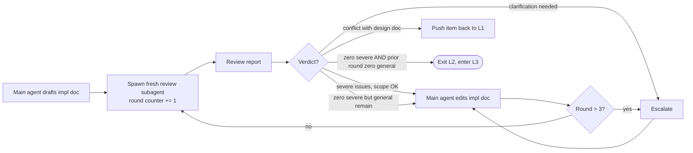

# L2: Implementation Document Loop

## Goal

Produce `docs/implementation/<task-slug>.md` (or append a new Phase to an existing file) such that a fresh agent can read it and immediately enter TDD development **without** reviewing the current session.

## Required sections

1. **Task Index**: pointers to the corresponding Deliverables and Acceptance Criteria entries in the design document (file path + line range).
2. **Phase Breakdown**: each Phase is self-contained and lists:
    - **Entry condition** — what the previous Phase must deliver.
    - **Design document references** — file plus line range.
    - **Task list, in TDD order** — test tasks listed before implementation tasks.
    - **Per-task acceptance command** — a pytest selector or shell command runnable directly from the repository root. English prose is not an acceptance command; if the command is not runnable as written, the Phase is rejected at review.
    - **Exit condition** — the state that defines Phase completion.
3. **Engineering Constraints Index**, with explicit pointers to:
    - Project-level engineering norms: CLAUDE.md _engineering-norms_ role.
    - Four-corner subagent template: `references/loop-3-development.md`.
    - Commit conventions: SKILL.md "Commit conventions" section (the `fix(phaseN-roundR):` prefix, etc.).
4. **Data and Fixture Dependencies**: which existing test resources can be reused, and whether new ones must be added.
5. **Regression Protection**: which prior-Phase tests must remain green.

## Main agent procedure

Calibration: write each Phase for an engineer with zero context for this codebase and no view of this session — exact file paths, exact acceptance commands, and the business invariant each test protects. Assume nothing is obvious.

1. Draft based on the passed design document. **Forbidden** to introduce new requirements not present in the design document. If a gap is discovered, push the item back to L1 instead of patching it locally.
2. Phase granularity principles (scope-based, not time-based):
    - A Phase is the smallest set of changes that is independently committable, leaves `<TEST-CMD>` green, and maps to a contiguous block of Deliverables. Most small features are a single Phase; split only when one of those invariants would be violated. **Do not pad a Phase to fill calendar time — agentic execution makes wall-clock estimates meaningless.**
    - `<TEST-CMD>` is fully green at the end of every Phase.
    - Every Phase declares at least one shell-reproducible `<ACCEPT-CMD>` (pytest selector, script invocation, or other deterministic command).
3. On encountering ambiguity (e.g., an acceptance criterion that cannot be translated to an executable test), immediately escalate or push the item back to L1 for design revision before re-entering this loop.

## Loop dynamic



## Termination conditions

Same as L1, with one addition: **the L2 round cap of 3 is counted independently**. If the design document is forced into rollback edits, the implementation document loop **must restart** from round 1. Commits already produced under the prior L3 cycle are listed by the main agent under a "Deprecated" section in `docs/implementation/<task-slug>.md` to prevent implementation drift. The Deprecated section is intentionally kept until task closeout — it gets pruned during F step 5 (document consolidation), since the git history will then preserve its content.

When an L2 rollback is triggered, the main agent must revert all L3 commits from the prior cycle, or explicitly note them as retained with user authorization (reverting published commits requires AskUserQuestion first). Each rollback event appends a dated sub-entry to the Deprecated section — for example: `Deprecated — rollback 1 (YYYY-MM-DD): commits <sha>…` — so multiple rollback rounds remain distinguishable.

> For structured output from this review subagent, see `references/schemas.md` (`ReviewVerdict` schema).

> Spawn this review as a fresh default subagent (a new general-purpose subagent, separate from the agent that drafted the document); no special agent type is required — role isolation, not a particular agent type, is what matters.

> **Optional escalation**: for a load-bearing or high-risk implementation plan, escalate to an adversarial **panel** review (N fresh voters, mechanical union) — see `references/multi-voter-review.md`.

> **Optional**: if the `three-loop-impl-reviewer` agent (`references/optional-subagents.md`) is installed, spawn it by name; the skill runs zero-install with a fresh default subagent without it.

## Review subagent prompt template

```plaintext
You are the implementation review engineer for the {{project-name}}
project.

[Task] Review {{impl-doc-path}} and confirm it can guide a fresh agent
to start work without ambiguity.

[Language constraint] Same as the L1 design review: violations of the
CLAUDE.md *language-policy* role in core contract files are severe
issues. The implementation document itself follows CLAUDE.md rules for
process documents, but its terminology must align with docs/design/ and
contract files.

[Steps]
1. Read {{impl-doc-path}} in full and {{design-doc-path}}.
2. For each Phase, answer five questions. Any "no" is a severe issue.
   a. Could a fresh agent start work using only this document plus the
      design document sections it cites?
   b. Are the acceptance commands actually runnable? (pytest selectors
      must reference tests defined in tests/ or required by the document
      to be created; shell commands must be runnable in the current
      repository.)
   c. Is the TDD order correct (test tasks before implementation tasks)?
   d. Does regression protection cover the critical paths of prior
      Phases?
   e. For each test task in the Phase task list: does the description
      specify the business invariant being protected, not just the
      function being called? A task description vague enough that the
      resulting test could be implemented as a shape-only assertion
      (passing regardless of whether the protected logic is intact)
      tests shape, not intent — flag as severe.
3. Check consistency with CLAUDE.md and the three-loop-workflow skill
   (commit prefix `fix(phaseN-roundR):`, language policy, load-bearing
   document list).
4. Coding philosophy check: flag any Phase task that exceeds the design
   scope as a severe issue (Simplicity First). Flag any acceptance
   criterion that is not mechanically verifiable as severe (Goal-Driven
   Execution).
5. Do not modify the document. Output only the review report.

[Trip-wires] A clean first round does not close L2 — the two-generation rule needs a confirming clean round; an unresolved general issue blocks closure.

[Calibration] Grade by actual severity: a genuine blocker is severe; a real but non-blocking defect is general; an advisory/cosmetic observation is a clarification. do not inflate a genuinely-misclassified should-fix item to severe — inflation burns the shared round budget and forces false escalations; this never lowers a real blocker.

[Grounding] Ground every finding: cite file:line (or section) from the diff/artifact; a pass must name at least one section read in full — verify by reading the diff, not the summary.

[Output format] Same as the L1 review template, with the section title
changed to "Implementation Document Review Report".
```

## Self-review before spawning the reviewer (free — does not increment {{round}}) — Common L2 traps

Before spawning the reviewer, re-read your draft once against this list and fix inline; this pass produces no verdict and never substitutes for the fresh review.

- Phases that bundle unrelated Deliverables or leave `<TEST-CMD>` red mid-Phase — split so each Phase is independently committable and CI-verifiable. Size by scope (one contiguous block of Deliverables), never by wall-clock time.
- Acceptance commands written as English prose ("run the tests and check the output looks right") instead of an actual shell command — must be a literal command anyone can paste.
- Implementation tasks listed before test tasks — reverses TDD order and is a severe issue.
- Quietly adding requirements not in the design doc — must roll back to L1 instead. The trace test (every changed line maps to a Deliverable) starts here.
- Missing regression protection for earlier Phases — without it, later Phases drift silently.
- Placeholder vagueness — "add validation" / "handle edge cases" / "write tests for the above" without naming the case/invariant or supplying the test; a fresh agent cannot act on it.
