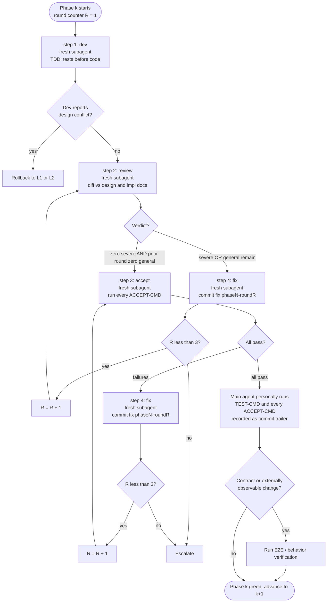

# L3: Development Work Loop

> **Recommended execution mode**: use the Workflow script at `references/loop-3-workflow.md`
> (invokes `l3-phase.js`) rather than manual Agent-tool orchestration. The script enforces
> round caps, structured verdicts, and the two-generation termination condition as
> deterministic code (dev writes to the main working tree — no worktree isolation). The
> four-corner template, role table, commit conventions, and E2E gate below remain
> authoritative regardless of which mode is used.

## Four-corner subagent template

Each Phase runs at least one cycle of step 1 (dev) → step 2 (review) → step 3 (accept). Review failures route through step 4 (fix) back to step 2; accept failures route through step 4 back to step 3. The Phase has its own round counter R, capped at 3.



Notes on the diagram:

- **Fresh subagent on every role node** — self-review is forbidden (the role-isolation hard constraint, below).
- **R increments only on a fix**; the cap is checked before re-entry. Hitting R = 3 unresolved escalates to the user (never a relaxed bar).
- **R is a single phase-wide budget shared by review and accept** — the accept loop continues the same counter (no fresh 3), so a review-heavy Phase may reach accept at the cap and escalate on the first accept failure (by design). A Phase that required a fix needs a later clean review round before it can close; a Phase whose first review is fully clean with no fix closes in one round (the L3-only clean-first-round relaxation; L1/L2 stay strict — see SKILL.md "Shared termination condition").
- **Accept failures loop back to step 3, not step 2.** The accept subagent re-runs commands without re-spawning the review subagent — the review already passed, so the failure is a code/test problem rather than a code-quality problem.
- **Phase-end main-agent verification** sits between the accept pass and the E2E gate, so its result is captured in the Phase commit trailer regardless of whether E2E is triggered.
- **The E2E / behavior gate is conditional.** It fires for a contract change OR an externally observable behavior change (UI / CLI / endpoint / user-visible output). Pure internal refactors, test-only changes, and README updates skip it and rely on `<TEST-CMD>` only.

> For structured output from review subagents (step 2), see `references/schemas.md` (`ReviewVerdict` schema).

> Spawn the dev subagent (step 1) and the review subagent (step 2) as separate fresh default subagents (no special agent type needed). The hard rule is role isolation: the agent that wrote the code must never review it.

> **Optional escalation**: for a load-bearing or high-risk Phase, run the review corner as an adversarial **panel** — pass `reviewMode: 'panel'` to `l3-phase.js`, or run `references/review-panel.js` directly. See `references/multi-voter-review.md`.

> **Optional**: if the `three-loop-l3-reviewer` / `three-loop-accept-runner` agents (`references/optional-subagents.md`) are installed, spawn them by name (note: tool restrictions apply on the manual path, not the Workflow `agent(prompt,{schema})` path); the skill runs zero-install without them.

## Role responsibilities

| Role | Input | Output | Forbidden |
|---|---|---|---|
| **step 1: dev** | Phase task list in impl doc + design doc references + exports, immediate callers, and shared utilities of files being modified | Code changes (TDD: tests first), task-list checkboxes ticked. Before reporting: self-review your diff against SKILL.md §0.2 (overcomplication) and §0.3 (trace test + no process-narration comments), confirm each assigned checkbox and that each new behavior has a test you watched fail; this self-review does NOT replace the fresh review corner — both run. | Modify the impl doc; expand scope unilaterally |
| **step 2: review** | dev's diff (obtained as the review subagent's first action via `git diff <baseSha>..<devBranch>` — the dev returns `baseSha`, captured before editing) + design doc + impl doc + CLAUDE.md; confirm test changes precede/accompany production changes for new behavior — a body of new production code with no corresponding new test is a severe Goal-Driven Execution issue | Review report (severe / general / clarification, format per L1 template) | Modify code |
| **step 3: accept** | Phase `<ACCEPT-CMD>` list from impl doc | Per-command exit code and key output, marked pass or fail; plus passed/failed/skipped/xfail tally per command (skipped tests are not passing tests) | Modify code or tests; interpret or judge output beyond the mechanical exit-code → pass/fail derivation (that is the review role's job) |
| **step 4: fix** | Failing items from step 2 or step 3, each item prefixed by a one-line root cause ('item X is caused by Y') | Minimal-scope code fix; commit prefix `fix(phaseN-roundR):`; for a correctness/behavior finding (not style/scope/comment): add a failing test that reproduces it first, then fix to green (red→green) | Structural refactors; introducing new requirements outside the design doc |

Fix corner is debugging, not patching: name the root cause of each failing item before editing and change that cause, one at a time. If a failing item has no identifiable cause after investigation, escalate via the design-conflict / escalation path — do not ship a guess.

> **Rationalizations — recognize and stop**: the review/accept/fix excuse trip-wires live in `references/escalation-rules.md`.

**Role isolation hard constraint**: within a single Phase, a single subagent takes only one role. The main agent spawns a fresh subagent per role per round. This binds to **identity**, not just to invocation: a subagent (or agent-team teammate) that authored or self-claimed the dev task for an artifact may never claim its review or accept — whether the second role would arrive by lead assignment, teammate self-claim, or lead plan-approval. Lead plan-approval is not the fresh-reviewer gate.

> **Review check — process-narration comments.** The review subagent must flag any comment in the diff that narrates the workflow — round/cycle history, review-iteration notes, design-doc/decision references — rather than explaining the code, as a Surgical-Changes issue (see SKILL.md §0.3 "Comments explain the code, not the workflow").

## Main agent constraints (per Phase)

- At the **end of each Phase**, the main agent personally runs `<TEST-CMD>` and every `<ACCEPT-CMD>` declared for that Phase in the impl doc. Results are recorded as trailers on the Phase commit. The pasted exit codes and tally must come from THIS closing run; a recalled tally or the accept subagent's earlier report is not sufficient — re-run fresh and record this run's output.
- If a dev subagent reports "the design doc conflicts with the task", the dev agent **must not** decide. Return to L1 or L2 to fix the source document.

## Commit conventions

- **Phase opener**: `feat(phaseN): <one-line summary>` or `fix(phaseN): …` depending on change nature.
- **Within-round fix**: `fix(phaseN-roundR): <failing-item-keyword>`. The keyword must name a failing item from the review or accept report — a drive-by edit has no valid keyword to name. The keyword is named by the author and **checked by the review subagent against the diff** (optionally pre-screened by the commit-prefix lint hook `references/validate-commit-msg.sh`, which enforces only the prefix grammar, not surgical-ness). The prefix alone does not prove a change is surgical; the review corner does.
- **Trailers** record `<TEST-CMD>` exit code and key `<ACCEPT-CMD>` results.
- **Do not** mention AI involvement, model names, or agent tooling in commit messages or PR descriptions.

Examples:

```
feat(phase2): introduce token bucket rate limiter

Test-Cmd: pytest tests/ -v (exit 0, 142 passed)
Accept-Cmd: pytest tests/ratelimit/ -k accept (exit 0)
```

```
fix(phase2-round2): off-by-one in bucket refill timing

Test-Cmd: pytest tests/ -v (exit 0, 142 passed)
```

## External-process / End-to-End verification

### When to trigger

Trigger when **either** holds:
- the task modifies an **external behavior contract**: contract files declared by the CLAUDE.md _load-bearing-docs_ role (such as SKILL.md, public API spec) or entry scripts / endpoints directly referenced by them; **or**
- the task **introduces or changes externally observable behavior** — a UI surface, a CLI command, an endpoint, or a user-visible output. Green unit tests are not a good app; observing the real behavior catches broken flows, wrong output, and regressions tests miss.

**Skip the E2E / behavior branch** for: pure internal refactors, test-only changes, and README updates. These rely on `<TEST-CMD>` only.

### Behavior verification (gating)

When the trigger fires because the change is externally observable, a **fresh subagent that is NOT the dev author of the Phase** drives the app along the new user path and records the observed behavior against the design's measurable Acceptance Criteria. This is a **gating** check, not decorative: an observed behavior that does not match a design Acceptance Criterion is a blocking finding that routes through the normal step-4 fix / round-cap machinery — never "observed, noted". Emit a structured pass/fail (AcceptVerdict-style, see `references/schemas.md`) so closure stays mechanical rather than "looks right".

Recommended drivers: the `/run` and `/verify` bundled skills (build and run the app to confirm a change works, without falling back to tests or type checks); for a non-standard launch (db/env/graphical/multi-step) `/run-skill-generator` produces a project-specific runner. The zero-install fallback is the existing manual smoke test (walk the entry-point flow by hand). Bake no project launch constants into the skill — the per-project recipe lives outside it.

### Pre-flight check (zero cost, no paid API calls)

Before spawning the E2E subprocess, verify auth is available so we don't burn paid calls on a misconfigured run:

```bash
# Example uses Claude Code; replace with the equivalent auth-probe command
# for other CLIs.
[ "$(id -u)" = "0" ] && { echo AUTH_FAIL; exit 0; }   # root often refused

if claude auth status >/dev/null 2>&1; then
  echo AUTH_OK
elif claude --version >/dev/null 2>&1 && [ -n "${ANTHROPIC_API_KEY:-}" ]; then
  echo AUTH_OK
else
  echo AUTH_FAIL
fi
```

On `AUTH_FAIL`: enter degraded path — skip the external-process spawn, fall back to `<TEST-CMD>` plus one manual smoke test (walk the entry-point flow described in the contract file by hand), and record `E2E skipped: <reason>` in the end-to-end review summary (reason must be specific — e.g., `AUTH_FAIL: ANTHROPIC_API_KEY not set`; see `references/end-to-end-review.md` step 3 for the specificity requirement)

### Isolated spawn procedure (example)

The example below uses the scenario "load and run a skill via a real CLI subprocess" (suitable for agent / skill / CLI tool projects). Web service projects can replace with "start the service in an isolated container plus run end-to-end test scripts". The general principles preserved are: **isolated worktree, ephemeral sandbox, artifact archival, automatic cleanup**.

```bash
set -euo pipefail                                # abort on any failure
TASK_SLUG="<kebab-case-task-id>"
STAMP="$(date -u +%Y%m%dT%H%M%SZ)"
SID="$(python3 -c 'import uuid; print(uuid.uuid4())')"
WT="$(mktemp -d -t e2e-wt-XXXXXX)"               # isolated worktree
SANDBOX="$(mktemp -d -t e2e-sandbox-XXXXXX)"     # one-shot sandbox
ARTIFACTS="./.e2e-artifacts/${TASK_SLUG}-${STAMP}"        # gitignore this
mkdir -p "${ARTIFACTS}"
git worktree add "${WT}" HEAD -b "e2e/${TASK_SLUG}-${STAMP}"

# Example: spawn the Claude CLI as a subprocess to load and run the skill.
# Other projects replace with curl / docker compose run / go run / etc.
(
  cd "${WT}"
  claude \
    --print \
    --dangerously-skip-permissions \
    --session-id "${SID}" \
    --output-format stream-json \
    --max-budget-usd 0.50 \
    -p "<end-to-end test prompt designed against the contract file, parameterized by SANDBOX>"
) > "${ARTIFACTS}/stream.jsonl" 2> "${ARTIFACTS}/stderr.log"

# Cleanup
git worktree remove --force "${WT}"
git branch -D "e2e/${TASK_SLUG}-${STAMP}" 2>/dev/null || true
rm -rf "${SANDBOX}"
# ${ARTIFACTS} is retained for archival. To promote into a test fixture,
# raise a separate PR (see Archival section).
```

### Archival and naming

- **Active artifacts**: `./.e2e-artifacts/<task-slug>-<UTC-ISO8601>/`. On first use, add `.e2e-artifacts/` to `.gitignore`.
- **Promoted to test fixture**: only after manual review, rename to `./tests/fixtures/e2e/<descriptive-slug>.<ext>` (create the directory if needed) and submit in a **separate** PR with an update note in `docs/implementation/`. **Do not** add fixtures opportunistically inside the feature PR.

## Phase termination conditions

A Phase is closed when ALL of the following hold:

- The accept subagent reports pass on every `<ACCEPT-CMD>` for the Phase.
- Full `<TEST-CMD>` and every `<ACCEPT-CMD>` declared in the impl doc exit with code 0.
- Main agent's personal re-run of `<TEST-CMD>` and `<ACCEPT-CMD>` matches the accept subagent's report (recorded as commit trailer).
- If E2E is triggered: external-process artifacts contain no errors beyond what the contract file allows. The impl doc must declare pass conditions explicitly (e.g., "lint JSON returns clean: true" or "HTTP 200 + JSON schema validation passes").
- Skill-self discipline edit: if a Phase edits a discipline rule of THIS skill (a termination condition, escalation trigger, tier boundary, principle, or rationalization counter), the **main agent runs (after accept passes)** a GREEN behavioral check — spawn one fresh subagent with a pressure scenario + the post-edit rule, confirm it complies, and record `Behavioral-check: complied` as a commit trailer. (The accept corner is mechanical and never judges output, so on the recommended Workflow L3 path this is a main-agent post-Workflow discharge — see `references/loop-3-workflow.md`.)

If round counter R hits 3 without all conditions met → escalate per `references/escalation-rules.md`, do not relax the bar.
