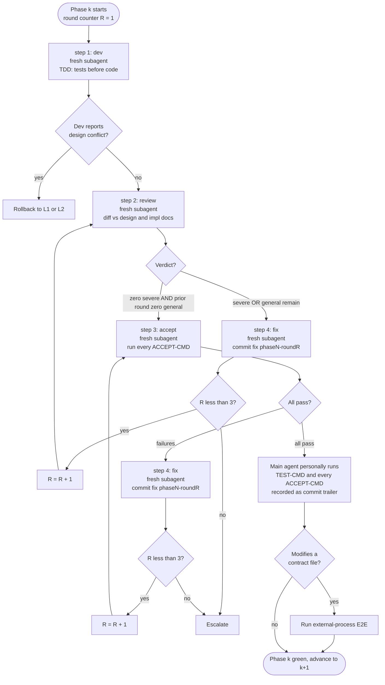

# L3: Development Work Loop

## Four-corner subagent template

Each Phase runs at least one cycle of step 1 (dev) → step 2 (review) → step 3 (accept). Review failures route through step 4 (fix) back to step 2; accept failures route through step 4 back to step 3. The Phase has its own round counter R, capped at 3.



Notes on the diagram:

- **Fresh subagent on every role node.** Within a single Phase, a single subagent may take only one role. Self-review is forbidden — this is how the role isolation rule is enforced.
- **R increments only on a fix.** The cap is checked before re-entry. Hitting R = 3 with the failure unresolved escalates to the user, never to a relaxed bar.
- **Accept failures loop back to step 3, not step 2.** The accept subagent re-runs commands without re-spawning the review subagent — the review already passed, so the failure is a code/test problem rather than a code-quality problem.
- **Phase-end main-agent verification** sits between the accept pass and the E2E gate, so its result is captured in the Phase commit trailer regardless of whether E2E is triggered.
- **The E2E gate is conditional.** Pure internal refactors, test changes, and README updates skip the E2E branch and rely on `<TEST-CMD>` only.

## Role responsibilities

| Role | Input | Output | Forbidden |
|---|---|---|---|
| **step 1: dev** | Phase task list in impl doc + design doc references + exports, immediate callers, and shared utilities of files being modified | Code changes (TDD: tests first), task-list checkboxes ticked | Modify the impl doc; expand scope unilaterally |
| **step 2: review** | dev's diff + design doc + impl doc + CLAUDE.md | Review report (severe / general / clarification, format per L1 template) | Modify code |
| **step 3: accept** | Phase `<ACCEPT-CMD>` list from impl doc | Per-command exit code and key output, marked pass or fail; plus passed/failed/skipped/xfail tally per command (skipped tests are not passing tests) | Modify code or tests; interpret or judge output beyond the mechanical exit-code → pass/fail derivation (that is the review role's job) |
| **step 4: fix** | Failing items from step 2 or step 3 | Minimal-scope code fix; commit prefix `fix(phaseN-roundR):` | Structural refactors; introducing new requirements outside the design doc |

**Role isolation hard constraint**: within a single Phase, a single subagent takes only one role. The main agent spawns a fresh subagent per role per round.

## Main agent constraints (per Phase)

- At the **end of each Phase**, the main agent personally runs `<TEST-CMD>` and every `<ACCEPT-CMD>` declared for that Phase in the impl doc. Results are recorded as trailers on the Phase commit.
- If a dev subagent reports "the design doc conflicts with the task", the dev agent **must not** decide. Return to L1 or L2 to fix the source document.

## Commit conventions

- **Phase opener**: `feat(phaseN): <one-line summary>` or `fix(phaseN): …` depending on change nature.
- **Within-round fix**: `fix(phaseN-roundR): <failing-item-keyword>`. The keyword must name a failing item from the review or accept report. Drive-by edits leave no valid keyword and thus cannot be committed under this convention — that is how Surgical Changes is enforced mechanically.
- **Trailers** record `<TEST-CMD>` exit code and key `<ACCEPT-CMD>` results.
- **Do not** mention AI involvement, model names, or agent tooling in commit messages or PR descriptions.

Examples:

```
feat(phase2): introduce token bucket rate limiter

Test-Cmd: pytest tests/ -v (exit 0, 142 passed)
Accept-Cmd: pytest tests/ratelimit/ -k accept (exit 0)
```

```
fix(phase2-round2): off-by-one in bucket refill timing

Test-Cmd: pytest tests/ -v (exit 0, 142 passed)
```

## External-process / End-to-End verification

### When to trigger

Only when the task modifies an **external behavior contract**: contract files declared by the CLAUDE.md _load-bearing-docs_ role (such as SKILL.md, public API spec) or entry scripts / endpoints directly referenced by them.

**Skip the E2E branch** for: pure internal refactors, test changes, and README updates. These rely on `<TEST-CMD>` only.

### Pre-flight check (zero cost, no paid API calls)

Before spawning the E2E subprocess, verify auth is available so we don't burn paid calls on a misconfigured run:

```bash
# Example uses Claude Code; replace with the equivalent auth-probe command
# for other CLIs.
[ "$(id -u)" = "0" ] && { echo AUTH_FAIL; exit 0; }   # root often refused

if claude auth status >/dev/null 2>&1; then
  echo AUTH_OK
elif claude --version >/dev/null 2>&1 && [ -n "${ANTHROPIC_API_KEY:-}" ]; then
  echo AUTH_OK
else
  echo AUTH_FAIL
fi
```

On `AUTH_FAIL`: enter degraded path — skip the external-process spawn, fall back to `<TEST-CMD>` plus one manual smoke test (walk the entry-point flow described in the contract file by hand), and record `E2E skipped: <reason>` in the end-to-end review summary.

### Isolated spawn procedure (example)

The example below uses the scenario "load and run a skill via a real CLI subprocess" (suitable for agent / skill / CLI tool projects). Web service projects can replace with "start the service in an isolated container plus run end-to-end test scripts". The general principles preserved are: **isolated worktree, ephemeral sandbox, artifact archival, automatic cleanup**.

```bash
set -euo pipefail                                # abort on any failure
TASK_SLUG="<kebab-case-task-id>"
STAMP="$(date -u +%Y%m%dT%H%M%SZ)"
SID="$(python3 -c 'import uuid; print(uuid.uuid4())')"
WT="$(mktemp -d -t e2e-wt-XXXXXX)"               # isolated worktree
SANDBOX="$(mktemp -d -t e2e-sandbox-XXXXXX)"     # one-shot sandbox
ARTIFACTS="./.e2e-artifacts/${TASK_SLUG}-${STAMP}"        # gitignore this
mkdir -p "${ARTIFACTS}"
git worktree add "${WT}" HEAD -b "e2e/${TASK_SLUG}-${STAMP}"

# Example: spawn the Claude CLI as a subprocess to load and run the skill.
# Other projects replace with curl / docker compose run / go run / etc.
(
  cd "${WT}"
  claude \
    --print \
    --dangerously-skip-permissions \
    --session-id "${SID}" \
    --output-format stream-json \
    --max-budget-usd 0.50 \
    -p "<end-to-end test prompt designed against the contract file, parameterized by SANDBOX>"
) > "${ARTIFACTS}/stream.jsonl" 2> "${ARTIFACTS}/stderr.log"

# Cleanup
git worktree remove --force "${WT}"
git branch -D "e2e/${TASK_SLUG}-${STAMP}" 2>/dev/null || true
rm -rf "${SANDBOX}"
# ${ARTIFACTS} is retained for archival. To promote into a test fixture,
# raise a separate PR (see Archival section).
```

### Archival and naming

- **Active artifacts**: `./.e2e-artifacts/<task-slug>-<UTC-ISO8601>/`. On first use, add `.e2e-artifacts/` to `.gitignore`.
- **Promoted to test fixture**: only after manual review, rename to `./tests/fixtures/e2e/<descriptive-slug>.<ext>` (create the directory if needed) and submit in a **separate** PR with an update note in `docs/implementation/`. **Do not** add fixtures opportunistically inside the feature PR.

## Phase termination conditions

A Phase is closed when ALL of the following hold:

- The accept subagent reports pass on every `<ACCEPT-CMD>` for the Phase.
- Full `<TEST-CMD>` and every `<ACCEPT-CMD>` declared in the impl doc exit with code 0.
- Main agent's personal re-run of `<TEST-CMD>` and `<ACCEPT-CMD>` matches the accept subagent's report (recorded as commit trailer).
- If E2E is triggered: external-process artifacts contain no errors beyond what the contract file allows. The impl doc must declare pass conditions explicitly (e.g., "lint JSON returns clean: true" or "HTTP 200 + JSON schema validation passes").

If round counter R hits 3 without all conditions met → escalate per `references/escalation-rules.md`, do not relax the bar.
